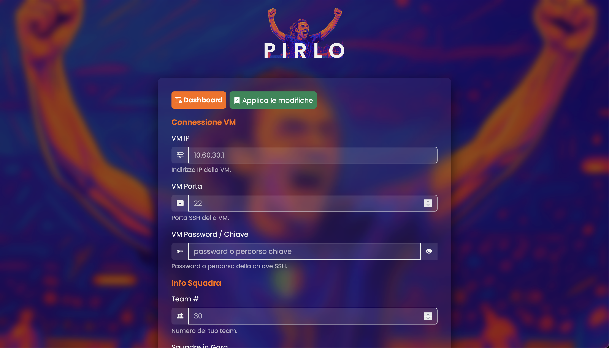

# PIRLO

PIRLO è un tool sviluppato per semplificare le operazioni dell'infraguy in vista della finale di CyberChallenge 2025. Fa parte della suite di servizi "ANDIAMO A TORINO BEPPE" e sfrutta un'interfaccia web basata su Flask per gestire containerizzati ambientati su Docker Compose e Docker SDK per Python. Con PIRLO puoi avviare, arrestare, buildare e monitorare i log dei container, permettendo un controllo centralizzato e immediato dei deploy e della configurazione.

## Indice

- [Panoramica](#panoramica)
- [Caratteristiche](#caratteristiche)
- [Struttura del Progetto](#struttura-del-progetto)
- [Prerequisiti](#prerequisiti)
- [Installazione](#installazione)
- [Configurazione](#configurazione)
- [Esecuzione dell'Applicazione](#esecuzione-dellapplicazione)
- [Endpoint di Gestione dei Container](#endpoint-di-gestione-dei-container)
- [Note per lo Sviluppo](#note-per-lo-sviluppo)
- [Licenza](#licenza)

## Panoramica

PIRLO fornisce un'interfaccia centralizzata per controllare e monitorare diversi servizi, come *CANNAVARO*, *TOTTI*, *TULIP* e lo stesso *PIRLO*. Grazie all'uso di route Flask, comandi Docker Compose e il Docker SDK per Python, l'applicazione consente di:
- Avviare o riavviare container, con la possibilità di forzare il rebuild.
- Arrestare i container in esecuzione.
- Effettuare il build delle immagini dei container tramite Docker Compose.
- Recuperare e visualizzare i log dei container in tempo reale.
- Applicare modifiche di configurazione, salvando le impostazioni in un file `.global.env` persistente.

## Caratteristiche

- **Controllo dei Container:** Gestisci i container direttamente tramite il cruscotto web.
- **Log in Tempo Reale:** Recupera i log dei container con messa in evidenza di errori e avvisi.
- **Gestione della Configurazione:** Modifica le impostazioni applicative tramite un'interfaccia form-based; le modifiche vengono salvate in `config/.global.env`.
- **Accesso Amministrativo:** Le operazioni critiche (ad esempio avvio, arresto e build dei container) sono protette da un token amministrativo.
- **Integrazione con Docker:** L'applicazione esegue comandi Docker Compose sul host tramite il socket montato `/var/run/docker.sock`.

## Struttura del Progetto

```
PIRLO/
├── app.py                   # Punto di ingresso principale dell'applicazione Flask
├── Dockerfile               # Dockerfile per costruire l'immagine di PIRLO
├── docker-compose.yml       # File di Compose per eseguire PIRLO e montare le risorse dell'host
├── runme.sh                 # Script per impostare HOST_IP ed eseguire i comandi docker-compose
├── requirements.txt         # Dipendenze Python
├── config/                  # Directory per la configurazione dell'ambiente
│   └── .global.env
├── Blueprints/              # Blueprint di Flask
│   ├── __init__.py
│   └── Containers/
│       ├── containers.py   # Endpoint per la gestione dei container
│       ├── templates/      # Template HTML per il cruscotto dei container
│       └── static/         # Asset statici (JS/CSS) per il cruscotto
├── utils/                   # Moduli di utilità (decoratori, validatori, ecc.)
│   ├── decorators.py
│   └── validators.py
├── deployers/               # Script di deploy per applicare configurazioni e gestire servizi
│   ├── cannavaro.py
│   └── start_config.py
├── static/                  # File statici aggiuntivi (stili, immagini, JavaScript)
└── templates/               # Template HTML principale per PIRLO
```

## Prerequisiti

- **Docker:** Installato sul sistema host.
- **Docker Compose:** Disponibile sull'host o installato all'interno del container (vedi Dockerfile).
- **Python 3.9+**: Necessario per eseguire l'applicazione Flask.

> **Nota:** Per permettere all'applicazione di gestire immagini e container Docker, assicurati di montare il socket Docker (`/var/run/docker.sock`) all'interno del container.

## Installazione

1. **Clonare il Repository**  
   Clona il repository del progetto nel tuo ambiente locale.

2. **Costruire l'Immagine Docker**  
   Dalla directory principale del progetto, esegui:
   ```bash
   docker-compose build
   ```

3. **Variabili d'Ambiente**  
   L'applicazione utilizza un file `.global.env` persistente (situato nella directory `config/`).

## Configurazione

- Aggiorna le variabili d'ambiente (ad esempio, `ADMIN_TOKEN`, `SECRET_KEY`, ecc.) secondo le necessità.
- Un form accessibile dalla pagina principale permette di impostare vari parametri come l'IP della VM, la password, i dettagli del team, la data/ora d'inizio del round, e il percorso dei file PCAP.
- Le impostazioni vengono salvate in `config/.global.env` utilizzando la funzione `set_key` di `python-dotenv`.

## Esecuzione dell'Applicazione

Dalla directory del progetto, esegui:
```bash
./runme.sh up [opzioni docker compose]
```
Il servizio verrà esposto sulla porta `10000` (come definito in `docker-compose.yml`). Accedi all'applicazione nel browser all'indirizzo `http://localhost:10000`.

Per eseguire l'applicazione in ambiente locale (senza Docker), assicurati di aver installato tutte le dipendenze e di aver configurato correttamente le variabili d'ambiente.

## Endpoint di Gestione dei Container

PIRLO espone una serie di endpoint (sotto `/containers`):
- **Dashboard:** `/containers/view` – Visualizza il cruscotto per la gestione dei container.
- **Avvio Container:** `/containers/api/<cid>/start?recreate=1` – Avvia o riavvia il container specificato. Aggiungi `?recreate=1` per effettuare il rebuild forzato.
- **Arresto Container:** `/containers/api/<cid>/stop` – Arresta il container indicato.
- **Build Container:** `/containers/api/<cid>/build` – Effettua il build del container specificato.
- **Log del Container:** `/containers/api/<cid>/logs` – Restituisce i log del container in formato JSON.
- **Stato di Tutti i Container:** `/containers/api/all-status` – Restituisce lo stato di tutti i container gestiti.

> **Sicurezza:** Tutti gli endpoint di gestione dei container sono protetti tramite un decoratore per amministratori. Assicurati di impostare correttamente il token amministrativo (configurabile in `utils/decorators.py`).

## Note per lo Sviluppo

- **Hot Reloading:** I mount dei volumi definiti in Docker Compose permettono il ricaricamento automatico delle modifiche al codice sorgente.
- **Integrazione con Docker:**  
  - Il Docker CLI è installato nel container e Docker Compose V2 è configurato come plugin, se necessario.
  - L'applicazione interagisce con il daemon Docker dell'host tramite il socket montato `/var/run/docker.sock`.
- **Logging e Debug:** I comandi Docker (ad esempio up, down, build) catturano sia `stdout` che `stderr` per facilitare il debug.
- **Interfaccia Frontend:** Utilizza Bootstrap, Flatpickr e JavaScript personalizzato per gestire le interazioni utente (ad esempio validazione dei form, notifiche, polling dei log).

## Licenza

Questo progetto viene fornito "così com'è", senza alcuna garanzia. Sei libero di modificarlo e utilizzarlo per scopi didattici o personali.